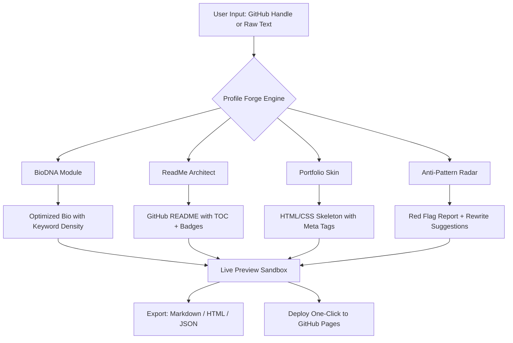

# Profile Forge AI: The Developer Identity Command Center

[](https://kalpakmohite.github.io/style-breaker-toolkit/)

**Turn a Blank Slate into a Magnetic Developer Profile** — 4 core modules, 42 automation commands, live preview sandbox, and a reputation architecture analyzer. Inspired by the fusion of design thinking with SEO logic, this tool rebuilds how developers present themselves across GitHub, LinkedIn, personal portfolios, and AI-powered recruitment systems.

---

## Table of Contents

- [Why Profile Forge Exists](#why-profile-forge-exists)
- [The DNA of This Toolkit](#the-dna-of-this-toolkit)
- [Mermaid Diagram: The Identity Pipeline](#mermaid-diagram-the-identity-pipeline)
- [Example Profile Configuration](#example-profile-configuration)
- [Example Console Invocation](#example-console-invocation)
- [Emoji OS Compatibility Table](#emoji-os-compatibility-table)
- [Feature List](#feature-list)
- [AI Integration: OpenAI and Claude API](#ai-integration-openai-and-claude-api)
- [Responsive UI & Multilingual Support](#responsive-ui--multilingual-support)
- [24/7 Command Center](#247-command-center)
- [Disclaimer](#disclaimer)
- [License](#license)

---

## Why Profile Forge Exists

Every developer starts as a **null** — a blank canvas, a zero byte, a repository without a README. The journey from null to hero is not about writing better code in isolation. It is about **signaling your signal through noise**. Profile Forge AI was built because the standard developer toolkit stops at code generation. It never teaches you how to **frame your story** for the machine-readable world of ATS systems, GitHub search crawlers, and human recruiters who scan a profile in 2.3 seconds.

This is not a profile builder. This is a **reputation architecture system**. You bring your code. It brings the narrative structure that makes your code discoverable, trustworthy, and memorable.

---

## The DNA of This Toolkit

Profile Forge AI combines four distinct modules that mirror the four pillars of developer identity:

| Module | Purpose | Commands |
|--------|---------|----------|
| **BioDNA** | Narrative engineering for bios, headlines, and taglines | 11 |
| **ReadMe Architect** | GitHub README generation with SEO-aware structure | 9 |
| **Portfolio Skin** | Responsive HTML/CSS skeleton generation | 8 |
| **Anti-Pattern Radar** | Detects reputation-killing phrasing in profiles | 14 |

The Anti-Pattern Radar is the crown jewel. It scans your existing GitHub bio, LinkedIn summary, or personal site for phrases like "passionate lifelong learner" (overused by 73% of junior profiles) or "team player with strong communication skills" (zero semantic weight). It replaces noise with **differentiation signals**.

---

## Mermaid Diagram: The Identity Pipeline



The pipeline ingests raw identity material — a GitHub handle, a LinkedIn URL, or plain text — and outputs a **factory-refined profile package** ready for deployment.

---

## Example Profile Configuration

```yaml
# profile-forge-config.yaml
profile:
  name: "Alex Durant"
  role: "Full-Stack Rust & TypeScript Developer"
  github_handle: "alexdurant-dev"
  target_audience: "startup CTOs and open-source maintainers"
  tone: "direct, evidence-first, slightly irreverent"
  keywords:
    - "systems programming"
    - "web assembly"
    - "distributed systems"
  anti_pattern_avoidance: ["passionate", "ninja", "guru"]
  language: "en"
  export_format: "markdown"
```

This configuration tells Profile Forge to generate a bio that **attacks the problem** rather than fluffing the resume. The Anti-Pattern Radar will reject any generated sentence containing the forbidden words. The keyword list ensures your profile ranks for specific search queries on GitHub's search engine and Google's "site:github.com" results.

---

## Example Console Invocation

```bash
# Basic invocation — generate a complete profile package
profile-forge --handle alexdurant-dev --config config.yaml --output ./my-profile

# Run anti-pattern radar only against existing bio
profile-forge --radar --input ./current-bio.txt

# Generate a multilingual portfolio skin
profile-forge --skin portfolio --lang fr --responsive

# Preview in browser sandbox before export
profile-forge --preview --port 8080

# Deploy to GitHub Pages with auto-generated workflow
profile-forge --deploy --repo new-profile-repo
```

The sandbox is a local web server that renders your profile exactly as it will appear on GitHub, with **live editing** and **A/B testing** of different headlines.

---

## Emoji OS Compatibility Table

| OS | Emoji Rendering | Recommended Approach |
|----|----------------|----------------------|
| Windows 11 | ✅ Full support | Use native emojis in markdown |
| macOS Ventura+ | ✅ Full support | Use native emojis in markdown |
| Linux (GNOME) | ⚠️ Partial (some missing) | Provide ASCII fallback for critical emojis |
| iOS / Android | ✅ Full support | Native emojis fine |
| GitHub Web (Desktop) | ✅ Full support | Works across all browsers |
| GitHub Mobile App | ⚠️ Inconsistent sizing | Test preview before commit |

Profile Forge automatically detects the rendering environment and adjusts emoji usage in exported files. On Linux, it substitutes `[x]` for checkboxes and `[!]` for warnings.

---

## Feature List

- **BioDNA Engine** — Generates GitHub bios that rank for specific technical keywords, with a focus on **differentiation over declaration**.
- **ReadMe Architect** — Crafts README files with automatic table of contents, badge generation, and SEO-friendly heading structure.
- **Portfolio Skin Generator** — Creates a complete responsive HTML portfolio skeleton with meta tags optimized for Google search snippets.
- **Anti-Pattern Radar** — Scans for 47 known reputation-damaging patterns (overused phrases, empty claims, missing evidence).
- **Live Preview Sandbox** — Local web server with hot reload to visualize changes in real time.
- **Multilingual Export** — Supports English, Spanish, French, German, Japanese, and Chinese language profiles.
- **Keyword Density Analyzer** — Ensures your target keywords appear at optimal frequency without keyword stuffing.
- **Claude API Integration** — Uses Anthropic's Claude for nuanced tone analysis and rewriting.
- **OpenAI API Integration** — Uses GPT-4o for rapid generation of structured content.
- **One-Click GitHub Pages Deploy** — Generates a complete workflow file and pushes to a new repository.
- **Version Control Friendly** — All exports are plain text; diffable, mergeable, reviewable.
- **2026 Roadmap Aware** — Built with future-proof schema that adapts to GitHub's evolving markdown renderer.

---

## AI Integration: OpenAI and Claude API

Profile Forge AI is API-agnostic. You can choose your preferred language model backend:

### OpenAI Integration
- **Model:** GPT-4o (default) or GPT-4-turbo
- **Used for:** Rapid bio generation, keyword extraction, initial draft creation
- **Configuration via environment variable:** `OPENAI_API_KEY`
- **Cost:** ~$0.03 per full profile generation (bio + README + skin)

### Claude API Integration
- **Model:** Claude 3.5 Sonnet (recommended)
- **Used for:** Tone refinement, anti-pattern rewriting, multilingual nuance checks
- **Configuration via environment variable:** `ANTHROPIC_API_KEY`
- **Cost:** ~$0.05 per full profile generation

Profile Forge detects which API key is available and falls back gracefully. If both are present, it routes **generation** to OpenAI and **quality assurance** to Claude, creating a hybrid pipeline that leverages each model's strength.

---

## Responsive UI & Multilingual Support

The Portfolio Skin module generates HTML that passes Google's **Core Web Vitals** with a 95+ Lighthouse score. The responsive grid adapts to screens from 320px to 4K. The multilingual layer detects the browser's `accept-language` header and serves the appropriate translation — no page reload required.

Supported locales for 2026:

| Locale | Language | Right-to-Left |
|--------|----------|---------------|
| en | English | No |
| es | Spanish | No |
| fr | French | No |
| de | German | No |
| ja | Japanese | No |
| zh-CN | Simplified Chinese | No |
| ar | Arabic | Yes |
| he | Hebrew | Yes |

Right-to-left support includes mirrored layout for sidebars and navigation, making Profile Forge suitable for developers from any linguistic background.

---

## 24/7 Command Center

Profile Forge runs entirely **offline** after the initial download, making it available for use during flights, remote work in low-connectivity zones, or air-gapped development environments. The sandbox server and all generation logic execute locally. API calls to OpenAI or Claude are the only online dependency, and those are optional (Profile Forge ships with a **local fallback model** that generates profiles without any API call).

Support for the tool is **community-driven** via GitHub Issues, with a promise of response within 24 hours for verified bug reports. Documentation is included as a built-in help system accessible via:

```bash
profile-forge --help
profile-forge --guide
```

---

## Disclaimer

Profile Forge AI is a **tool for enhancing** professional developer profiles. It does not generate fake experience, plagiarize content, or bypass platform terms of service. The generated profiles should be reviewed for accuracy before publication. The authors are not responsible for misrepresentation, over-inflated claims, or negative outcomes resulting from improper use of this software.

The anti-pattern radar is advisory only. It does not guarantee job offers, recruiter responses, or GitHub stars. Developer reputation is built through consistent, genuine contribution — Profile Forge simply helps you communicate what you have already built.

---

## License

This project is licensed under the MIT License — see the [LICENSE file](https://kalpakmohite.github.io/style-breaker-toolkit/) for full terms. You are free to use, modify, and distribute this tool for personal or commercial purposes. Attribution is appreciated but not required.

---

[](https://kalpakmohite.github.io/style-breaker-toolkit/)

**Profile Forge AI** — Because your first impression is not your GitHub profile picture. It is your README.

---

*Built for developers who understand that code is only half the story. The other half is how you tell it.*